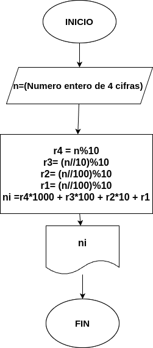

# Numero-invertido
Programa en phyton para invertir un número de 4 cifras
 
# Variable de entrada
- dg 1
- dg 2
- dg 3
- dg 4

# Procesamiento
- r4 = ultimo digito
- r3 = tercer digito
- r2 = segundo digito
- r1 = primer digito

- ni = número invertido

$ni = r4*1000 + r3*100 + r2*10 + r1$

# Diseño

# Construcción
- Codigo implementado en el archivo "Numero-invertido" 
